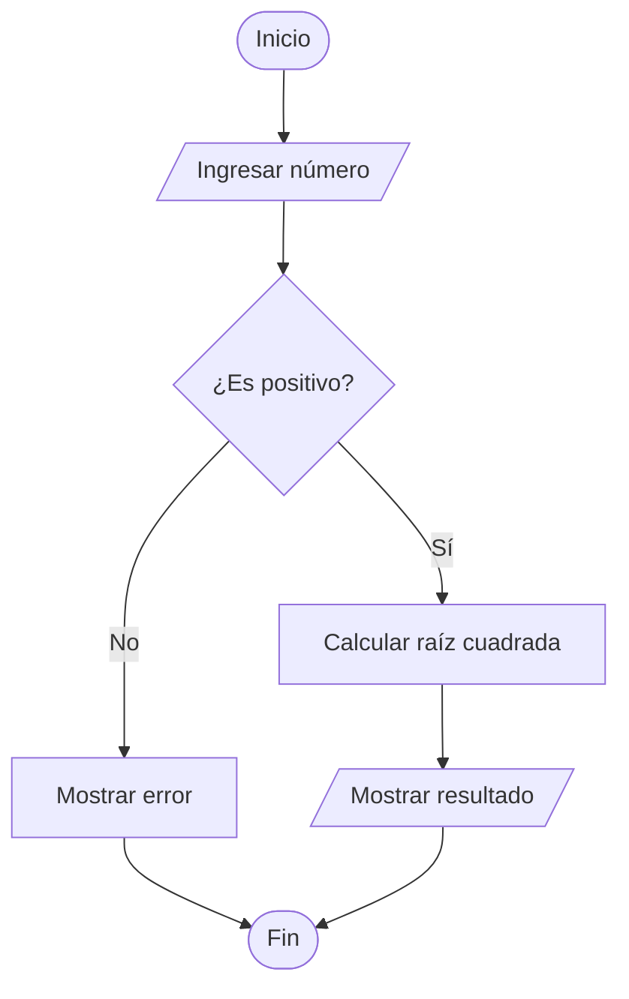
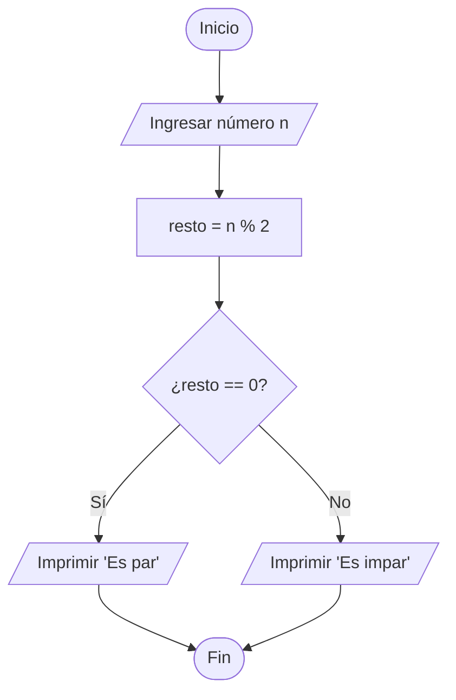
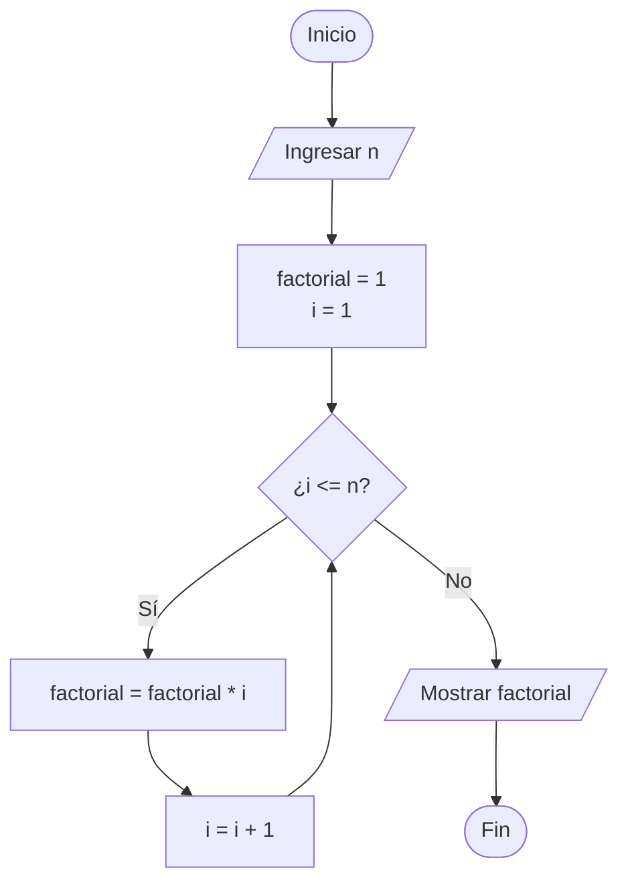
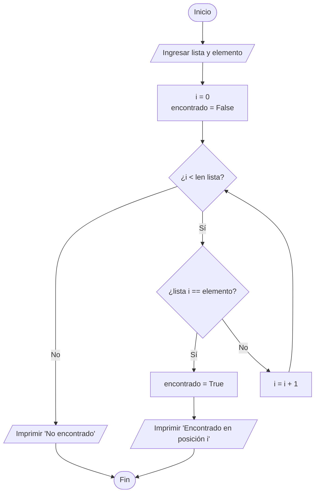
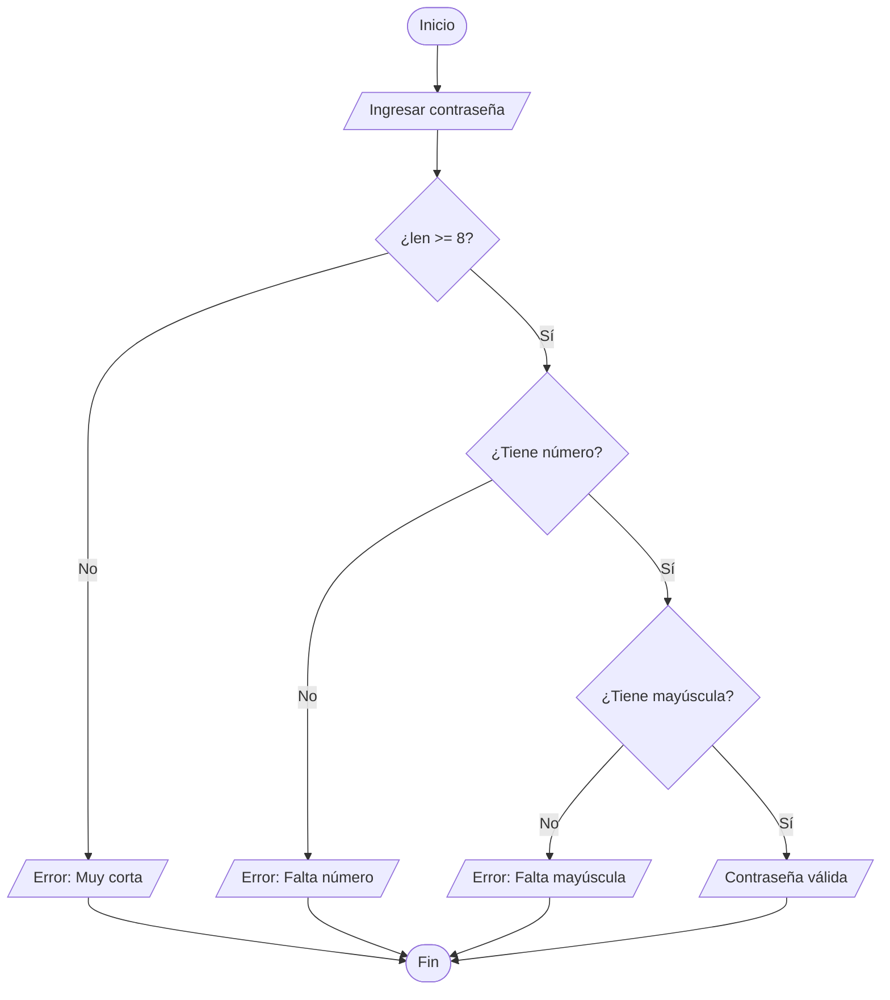
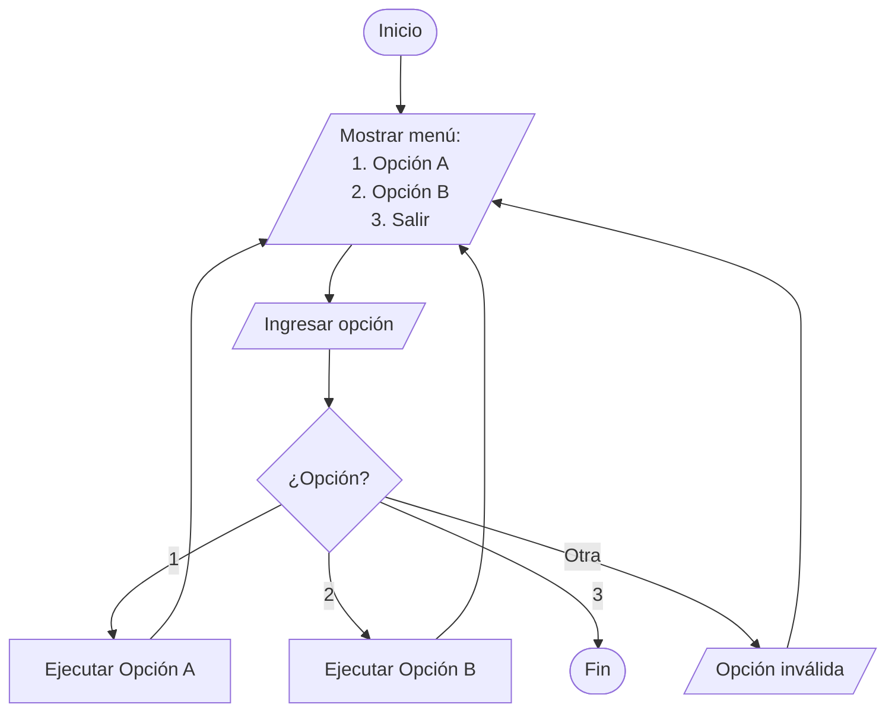
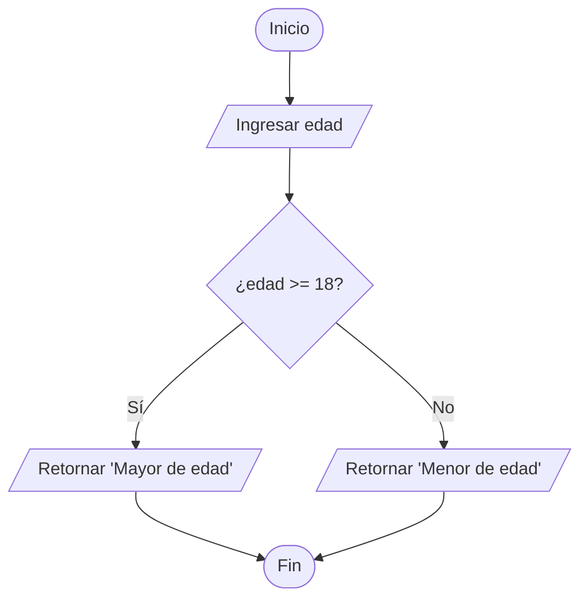
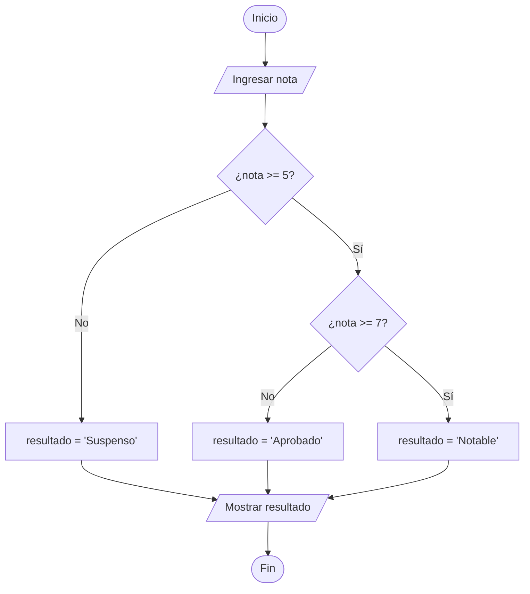
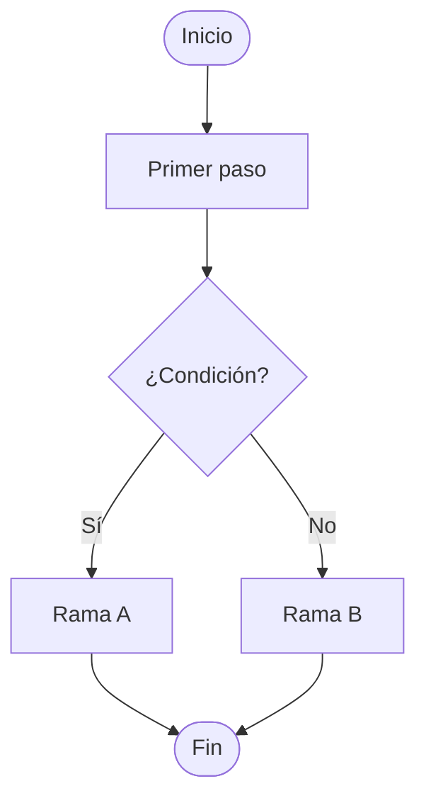

# 📚 Apuntes COD - Examen Práctico DAM

**Módulo**: Contornos de Desenvolvimiento  
**Nivel**: Ciclo Superior DAM  
**Versión**: 2025

---

## 📋 Tabla de Contenidos

**💡 Consejo**: Usa `Ctrl+F` para buscar rápidamente. Busca estas palabras clave:

```
"WORKFLOW DEL EXAMEN"    - Paso a paso del examen
"Git - Control"          - Todo sobre Git
"PEP8 - Estilo"          - Reglas de código Python
"Markdown - Doc"         - Sintaxis de documentación
"Debug - Depuración"     - Técnicas de debugging
"Diagramas de Flujo"     - Símbolos y ejemplos
"CHECKLIST PRE"          - Revisión antes de entregar
"COMANDOS DE EMERGENCIA" - Soluciones rápidas
```

**Secciones principales:**
1. WORKFLOW DEL EXAMEN (línea ~25)
2. Git - Control de Versiones (línea ~80)
3. PEP8 - Estilo de Código Python (línea ~350)
4. Markdown - Documentación (línea ~600)
5. Debug - Depuración (línea ~900)
6. Diagramas de Flujo (línea ~1150)
7. CHECKLIST PRE-ENTREGA (línea ~1400)

---

## 🚀 WORKFLOW DEL EXAMEN

### Paso a Paso desde Inicio hasta Entrega

```bash
# 1. INICIO - Configurar el entorno
git config --global user.name "Tu Nombre"
git config --global user.email "tu@email.com"

# 2. CREAR REPOSITORIO LOCAL
mkdir nombre-proyecto
cd nombre-proyecto
git init

# 3. CREAR ESTRUCTURA BÁSICA
touch README.md
touch .gitignore
mkdir src
touch src/main.py

# 4. PRIMER COMMIT
git add .
git commit -m "Initial commit: Estructura básica del proyecto"

# 5. CREAR REPO EN GITHUB (desde web)
# - New repository → Private → NO inicializar con README

# 6. CONECTAR CON GITHUB
git remote add origin https://github.com/usuario/repo.git
git branch -M main
git push -u origin main

# 7. DURANTE EL DESARROLLO
# Hacer commits frecuentes cada funcionalidad completada
git add .
git commit -m "feat: Descripción clara del cambio"
git push

# 8. ANTES DE ENTREGAR
# - Revisar que todo compila sin errores
# - Verificar PEP8
# - Completar README.md
# - Último commit y push
git add .
git commit -m "docs: Actualizar README y documentación final"
git push

# 9. COMPARTIR CON PROFESOR
# Settings → Collaborators → Add people → email del profesor
```

### ⏱️ Gestión del Tiempo (Examen de 3h)

- **00:00-00:15**: Setup inicial (Git, estructura, .gitignore)
- **00:15-02:15**: Desarrollo del código (commits cada 20-30 min)
- **02:15-02:45**: Testing, debugging, correcciones
- **02:45-03:00**: README, documentación final, último push

---

## 🔧 Git - Control de Versiones

### 📌 CHEAT SHEET - Comandos Esenciales

```bash
# CONFIGURACIÓN INICIAL
git config --global user.name "Tu Nombre"
git config --global user.email "tu@email.com"
git config --list  # Ver configuración

# CREAR REPOSITORIO
git init  # Iniciar repo en carpeta actual
git clone URL  # Clonar repo existente

# COMANDOS BÁSICOS
git status  # Ver estado actual
git add archivo.py  # Añadir archivo específico
git add .  # Añadir todos los cambios
git commit -m "mensaje"  # Guardar cambios
git push  # Subir a remoto
git pull  # Descargar cambios

# HISTORIAL Y REVISIÓN
git log  # Ver historial completo
git log --oneline  # Historial resumido
git log --graph --oneline  # Historial visual
git diff  # Ver cambios no confirmados
git diff archivo.py  # Ver cambios en archivo específico
git show COMMIT_ID  # Ver detalles de un commit

# DESHACER CAMBIOS
git restore archivo.py  # Descartar cambios locales
git restore --staged archivo.py  # Quitar de staging
git reset HEAD~1  # Deshacer último commit (mantener cambios)
git reset --hard HEAD~1  # Deshacer último commit (BORRAR cambios)
git revert COMMIT_ID  # Crear commit que deshace otro

# RAMAS
git branch  # Listar ramas
git branch nombre-rama  # Crear rama
git checkout nombre-rama  # Cambiar a rama
git checkout -b nueva-rama  # Crear y cambiar a rama
git merge nombre-rama  # Fusionar rama actual con otra
git branch -d nombre-rama  # Eliminar rama

# REPOSITORIO REMOTO
git remote -v  # Ver remotos configurados
git remote add origin URL  # Añadir remoto
git push -u origin main  # Primer push de rama
git push  # Push en rama ya configurada
```

### 🎯 Conceptos Clave

#### ¿Qué es Git?
Sistema de control de versiones distribuido que permite:
- Rastrear cambios en el código
- Colaborar con otros desarrolladores
- Volver a versiones anteriores
- Experimentar con ramas sin afectar el código principal

#### Estados de los archivos en Git
1. **Working Directory**: Cambios sin rastrear
2. **Staging Area**: Cambios preparados para commit (`git add`)
3. **Repository**: Cambios guardados permanentemente (`git commit`)

#### Workflow típico
```
[Modificar archivo] → git add → git commit → git push
```

### 💻 Ejemplos Prácticos

#### Ejemplo 1: Inicio de proyecto completo

```bash
# Crear proyecto
mkdir mi-proyecto-dam
cd mi-proyecto-dam
git init

# Crear archivos básicos
echo "# Mi Proyecto DAM" > README.md
echo "*.pyc\n__pycache__/\n.venv/\n.env" > .gitignore

# Primer commit
git add .
git commit -m "Initial commit: Configuración inicial del proyecto"

# Conectar con GitHub
git remote add origin https://github.com/usuario/mi-proyecto-dam.git
git branch -M main
git push -u origin main
```

#### Ejemplo 2: Trabajo con ramas

```bash
# Crear rama para nueva funcionalidad
git checkout -b feature/calculadora

# Hacer cambios...
# ... editar archivos ...

# Guardar cambios
git add .
git commit -m "feat: Implementar operaciones básicas de calculadora"

# Volver a main y fusionar
git checkout main
git merge feature/calculadora

# Eliminar rama ya fusionada
git branch -d feature/calculadora

# Subir cambios
git push
```

#### Ejemplo 3: Resolver conflicto simple

```bash
# Cuando hay conflicto tras merge o pull, Git marca el archivo:
# <<<<<<< HEAD
# código actual
# =======
# código entrante
# >>>>>>> rama-otra

# 1. Abrir archivo con conflicto
# 2. Elegir qué código mantener (eliminar marcadores <<< === >>>)
# 3. Guardar archivo
# 4. Marcar como resuelto
git add archivo-con-conflicto.py
git commit -m "fix: Resolver conflicto de merge en archivo.py"
```

### 📄 .gitignore - Archivos a Ignorar

```gitignore
# Python
*.pyc
*.pyo
__pycache__/
*.so
*.egg
*.egg-info/
dist/
build/
*.log

# Entornos virtuales
venv/
.venv/
env/
ENV/

# IDEs
.vscode/
.idea/
*.swp
*.swo
*~

# Sistema operativo
.DS_Store
Thumbs.db

# Configuración sensible
.env
secrets.json
config.local.py

# Archivos de testing
.pytest_cache/
.coverage
htmlcov/

# Documentos temporales
*.tmp
*.bak
```

### 📝 Convenciones de Mensajes de Commit

```bash
# Formato: tipo: descripción breve
# Tipos comunes:
feat: Nueva funcionalidad
fix: Corrección de bug
docs: Cambios en documentación
style: Formato, espacios (no afecta código)
refactor: Refactorización de código
test: Añadir o modificar tests
chore: Mantenimiento, dependencias

# Ejemplos BUENOS:
git commit -m "feat: Añadir función de validación de email"
git commit -m "fix: Corregir división por cero en calculadora"
git commit -m "docs: Actualizar README con instrucciones de instalación"
git commit -m "refactor: Simplificar función de ordenamiento"

# Ejemplos MALOS:
git commit -m "cambios"
git commit -m "fix"
git commit -m "asdf"
git commit -m "actualización final final de verdad"
```

### ⚠️ Errores Comunes y Soluciones

#### Error 1: "fatal: not a git repository"
```bash
# Solución: Estás en carpeta sin Git iniciado
git init
```

#### Error 2: Olvidé hacer commit antes de cambiar de rama
```bash
# Solución: Guardar cambios temporalmente
git stash
git checkout otra-rama
# Cuando vuelvas:
git checkout rama-original
git stash pop
```

#### Error 3: Commit al repo equivocado
```bash
# Solución: Cambiar URL remota
git remote set-url origin https://github.com/usuario/repo-correcto.git
git remote -v  # Verificar
```

#### Error 4: Quiero deshacer el último commit
```bash
# Si NO has hecho push:
git reset HEAD~1  # Mantiene cambios
# o
git reset --hard HEAD~1  # BORRA cambios (¡cuidado!)

# Si YA hiciste push:
git revert HEAD  # Crea nuevo commit que deshace el anterior
```

#### Error 5: Conflicto al hacer pull
```bash
# Ver qué archivos tienen conflicto
git status

# Editar archivos manualmente, resolver conflictos
# Buscar: <<<<<<< HEAD

# Marcar como resuelto
git add archivo-resuelto.py
git commit -m "fix: Resolver conflicto en archivo.py"
```

### 🎓 Tips para el Examen

1. **Haz commits frecuentes**: Cada 15-20 minutos o cada funcionalidad
2. **Mensajes descriptivos**: El profesor revisará tu historial
3. **No hagas `git reset --hard`** en examen (puedes perder trabajo)
4. **Revisa `git status`** antes de cada commit
5. **Push frecuente**: No solo al final (por si hay problemas de red)
6. **Prueba conexión a GitHub** al inicio del examen

---

## ✨ PEP8 - Estilo de Código Python

### 📌 CHEAT SHEET - Reglas Principales

```python
# INDENTACIÓN: 4 espacios (NO tabs)
def funcion():
    if True:
        print("4 espacios por nivel")

# LÍNEAS: Máximo 79 caracteres
# Si es más largo, partir la línea
resultado = funcion_muy_larga(
    parametro1, parametro2,
    parametro3, parametro4
)

# ESPACIOS EN OPERADORES
x = 5 + 3  # ✓ Correcto
x=5+3      # ✗ Incorrecto

# SIN ESPACIOS en llamadas de función
funcion(arg1, arg2)  # ✓ Correcto
funcion( arg1, arg2 )  # ✗ Incorrecto

# LÍNEAS EN BLANCO
# 2 líneas antes de clase o función de nivel superior
# 1 línea entre métodos de una clase

class MiClase:
    
    def metodo1(self):
        pass
    
    def metodo2(self):
        pass

# IMPORTS: Uno por línea, agrupados
import os
import sys

from typing import List, Dict
```

### 🎯 Nomenclatura (Naming Conventions)

```python
# VARIABLES y FUNCIONES: snake_case
mi_variable = 10
nombre_completo = "Juan"

def calcular_promedio(numeros):
    return sum(numeros) / len(numeros)

# CONSTANTES: UPPER_CASE
MAX_INTENTOS = 3
PI = 3.14159
RUTA_ARCHIVO = "/ruta/al/archivo"

# CLASES: PascalCase
class MiClase:
    pass

class CalculadoraCientifica:
    pass

# VARIABLES PRIVADAS: _guion_bajo
class Ejemplo:
    def __init__(self):
        self._variable_privada = 0
        self.variable_publica = 1

# MÉTODOS PRIVADOS: _guion_bajo
class Ejemplo:
    def _metodo_privado(self):
        pass
    
    def metodo_publico(self):
        self._metodo_privado()
```

### 📦 Imports y Organización

```python
# ORDEN DE IMPORTS (separados por línea en blanco):
# 1. Librería estándar
# 2. Librerías de terceros
# 3. Módulos locales

# Correcto:
import os
import sys
from datetime import datetime

import numpy as np
import pandas as pd

from mi_modulo import mi_funcion
from .utils import helper


# Incorrecto:
from mi_modulo import *  # ✗ NO usar import *
import sys, os  # ✗ Imports separados
```

### 💬 Comentarios y Docstrings

```python
# Comentarios: Frases completas, primera letra mayúscula

# Esto es un comentario correcto.
# Explica el porqué, no el qué.

# Docstrings: Triple comillas, describe qué hace la función

def calcular_area_rectangulo(base, altura):
    """
    Calcula el área de un rectángulo.
    
    Args:
        base (float): La base del rectángulo.
        altura (float): La altura del rectángulo.
    
    Returns:
        float: El área del rectángulo.
    
    Raises:
        ValueError: Si base o altura son negativos.
    """
    if base < 0 or altura < 0:
        raise ValueError("Las dimensiones no pueden ser negativas")
    return base * altura


class Calculadora:
    """
    Clase para realizar operaciones matemáticas básicas.
    
    Attributes:
        precision (int): Número de decimales en los resultados.
    """
    
    def __init__(self, precision=2):
        """
        Inicializa la calculadora.
        
        Args:
            precision (int): Decimales para redondear resultados.
        """
        self.precision = precision
```

### ✅ Código CORRECTO vs ❌ INCORRECTO

#### Ejemplo 1: Espaciado y formato

```python
# ❌ INCORRECTO
def suma(a,b):
    resultado=a+b
    return resultado

x=suma(5,3)

# ✅ CORRECTO
def suma(a, b):
    resultado = a + b
    return resultado

x = suma(5, 3)
```

#### Ejemplo 2: Líneas largas

```python
# ❌ INCORRECTO (más de 79 caracteres)
def funcion_con_muchos_parametros(parametro1, parametro2, parametro3, parametro4, parametro5):
    pass

# ✅ CORRECTO
def funcion_con_muchos_parametros(
    parametro1, parametro2, parametro3,
    parametro4, parametro5
):
    pass

# o también:
def funcion_con_muchos_parametros(
    parametro1,
    parametro2,
    parametro3,
    parametro4,
    parametro5
):
    pass
```

#### Ejemplo 3: Nomenclatura

```python
# ❌ INCORRECTO
class miClase:  # Debería ser PascalCase
    def MiMetodo(self):  # Debería ser snake_case
        MiVariable = 5  # Debería ser snake_case
        return MiVariable

maxintentos = 3  # Constante, debería ser UPPER_CASE

# ✅ CORRECTO
class MiClase:
    def mi_metodo(self):
        mi_variable = 5
        return mi_variable

MAX_INTENTOS = 3
```

#### Ejemplo 4: Imports

```python
# ❌ INCORRECTO
import sys, os  # Dos en una línea
from math import *  # Import *
import pandas
import os  # Ya importado, mal orden

# ✅ CORRECTO
import os
import sys

import pandas
```

#### Ejemplo 5: Estructura de código

```python
# ❌ INCORRECTO (sin espacios, mal formato)
class MiClase:
    def __init__(self):
        self.x=5
    def metodo(self):
        return self.x*2
def funcion():
    return 10

# ✅ CORRECTO
class MiClase:
    
    def __init__(self):
        self.x = 5
    
    def metodo(self):
        return self.x * 2


def funcion():
    return 10
```

### 🛠️ Herramientas para Verificar PEP8

#### pylint
```bash
# Instalar
pip install pylint

# Usar
pylint archivo.py
pylint src/  # Analizar todo el directorio

# Genera puntuación de 0 a 10 y lista errores
```

#### flake8
```bash
# Instalar
pip install flake8

# Usar
flake8 archivo.py
flake8 .  # Todo el proyecto

# Más rápido que pylint, solo errores
```

#### black (Formateador automático)
```bash
# Instalar
pip install black

# Formatear archivo
black archivo.py

# Formatear proyecto
black .

# Ver qué cambiaría sin modificar (dry-run)
black --check archivo.py
```

#### autopep8
```bash
# Instalar
pip install autopep8

# Formatear archivo
autopep8 --in-place archivo.py

# Ver cambios sin aplicar
autopep8 --diff archivo.py
```

### ⚠️ Errores Comunes en Examen

1. **Olvidar espacios alrededor de operadores**
   ```python
   # Mal: x=5+3
   # Bien: x = 5 + 3
   ```

2. **Mezclar tabs y espacios** (usa siempre 4 espacios)

3. **Nombres de variables no descriptivos**
   ```python
   # Mal: x = input()
   # Bien: nombre_usuario = input()
   ```

4. **Líneas demasiado largas** (> 79 caracteres)

5. **Funciones sin docstring**

### 🎓 Tips para el Examen

1. **Antes de entregar**: `flake8 .` para verificar errores
2. **Usa nombres descriptivos**: el profesor debe entender tu código sin ejecutarlo
3. **Añade docstrings** a funciones principales
4. **Sigue convenciones**: aunque funcione, se evalúa el estilo
5. **Revisa espaciado**: 4 espacios, espacios en operadores
6. **Configuración IDE**: VS Code puede formatear automáticamente (Shift+Alt+F)

---

## 📝 Markdown - Documentación

### 📌 CHEAT SHEET - Sintaxis Completa

```markdown
# Encabezado 1
## Encabezado 2
### Encabezado 3
#### Encabezado 4

**Negrita** o __Negrita__
*Cursiva* o _Cursiva_
***Negrita y cursiva***
~~Tachado~~

- Lista desordenada
- Otro elemento
  - Subelemento (2 espacios)

1. Lista ordenada
2. Segundo elemento
3. Tercer elemento

[Texto del enlace](https://url.com)


`código inline`

\```python
# Bloque de código con sintaxis
def funcion():
    return "Hola"
\```

> Cita o nota importante
> Puede tener múltiples líneas

---
Línea horizontal

| Columna 1 | Columna 2 | Columna 3 |
|-----------|-----------|-----------|
| Dato 1    | Dato 2    | Dato 3    |
| Dato 4    | Dato 5    | Dato 6    |

- [ ] Checkbox sin marcar
- [x] Checkbox marcado
```

### 📄 Estructura de README.md para Proyectos

```markdown
# Título del Proyecto

Breve descripción del proyecto en 1-2 líneas.

## 📋 Descripción

Explicación más detallada de qué hace el proyecto y para qué sirve.

## 🚀 Características

- Funcionalidad 1
- Funcionalidad 2
- Funcionalidad 3

## 🛠️ Tecnologías Utilizadas

- Python 3.11
- Git / GitHub
- Otras librerías relevantes

## 📦 Instalación

\```bash
# Clonar el repositorio
git clone https://github.com/usuario/proyecto.git

# Entrar al directorio
cd proyecto

# Instalar dependencias
pip install -r requirements.txt
\```

## 💻 Uso

\```python
# Ejemplo de uso del programa
python main.py

# O un ejemplo de código
from mi_modulo import funcion
resultado = funcion(parametro)
\```

## 📂 Estructura del Proyecto

\```
proyecto/
│
├── src/
│   ├── main.py
│   └── utils.py
│
├── tests/
│   └── test_main.py
│
├── docs/
│   └── documentacion.md
│
├── README.md
├── .gitignore
└── requirements.txt
\```

## 🧪 Tests

\```bash
# Cómo ejecutar los tests
python -m pytest tests/
\```

## 📝 Documentación Adicional

- [Documentación completa](docs/documentacion.md)
- [Guía de contribución](CONTRIBUTING.md)

## ✅ Estado del Proyecto

- [x] Funcionalidad básica implementada
- [x] Tests unitarios
- [ ] Interfaz gráfica (en desarrollo)
- [ ] Despliegue en producción

## 👤 Autor

**Tu Nombre**
- GitHub: [@usuario](https://github.com/usuario)
- Email: tu@email.com

## 📄 Licencia

Este proyecto está bajo la Licencia MIT - ver [LICENSE](LICENSE) para más detalles.

## 🙏 Agradecimientos

- Agradecimiento 1
- Agradecimiento 2
```

### 🎨 Emojis Útiles para Documentación

```markdown
📚 Documentación
🚀 Comenzar / Instalación
💻 Código / Desarrollo
🐛 Bugs / Correcciones
✨ Nuevas características
🔧 Configuración
📦 Paquetes / Dependencias
🧪 Tests / Pruebas
📝 Notas / Documentación
✅ Completado / Checklist
❌ Error / No hacer
⚠️ Advertencia
💡 Tip / Idea
🎯 Objetivo
📊 Estadísticas / Datos
🔍 Buscar / Investigación
📂 Archivos / Estructura
👤 Usuario / Autor
📄 Licencia
🌟 Destacado
```

### 📊 Tablas Avanzadas

```markdown
# Tabla simple
| Nombre    | Edad | Ciudad     |
|-----------|------|------------|
| Juan      | 25   | Madrid     |
| María     | 30   | Barcelona  |

# Tabla con alineación
| Izquierda | Centro | Derecha |
|:----------|:------:|--------:|
| Texto     | Texto  | Texto   |
| Más texto | Centro | 123     |

# Tabla con código
| Función      | Descripción                | Ejemplo           |
|--------------|----------------------------|-------------------|
| `len()`      | Longitud de lista          | `len([1, 2, 3])`  |
| `sum()`      | Suma elementos             | `sum([1, 2, 3])`  |
| `max()`      | Elemento máximo            | `max([1, 5, 3])`  |
```

### 🔗 Enlaces y Referencias

```markdown
# Enlaces simples
[Google](https://google.com)
[Enlace con título](https://ejemplo.com "Título al pasar mouse")

# Enlaces a secciones internas
[Ir a Instalación](#instalación)
[Volver arriba](#título-del-proyecto)

# Enlaces de referencia (más limpio)
Ver [documentación oficial][1] y [guía de estilo][2].

[1]: https://docs.python.org
[2]: https://pep8.org

# Imágenes


# Imagen con enlace
[](https://enlace.com)
```

### 🏆 Badges / Shields

```markdown
# Badges comunes (añadir a README)


# Badge de GitHub


# Badge de build

```

### 💻 Bloques de Código Avanzados

```markdown
# Código con resaltado de sintaxis
\```python
def saludar(nombre):
    """Función que saluda."""
    return f"Hola, {nombre}!"

print(saludar("Mundo"))
\```

# Otros lenguajes
\```javascript
function saludar(nombre) {
    return `Hola, ${nombre}!`;
}
\```

\```bash
#!/bin/bash
echo "Script de Bash"
\```

\```sql
SELECT * FROM usuarios WHERE edad > 18;
\```

# Código con nombre de archivo
\```python
# archivo: main.py
def main():
    print("Programa principal")
\```

# Salida de terminal
\```bash
$ python main.py
Hola, Mundo!
$ 
\```
```

### 📚 Ejemplo de README Completo para Examen DAM

```markdown
# 🧮 Calculadora Científica

Aplicación de calculadora científica desarrollada para el examen práctico del módulo COD.

## 📋 Descripción

Calculadora que permite realizar operaciones matemáticas básicas y avanzadas,
incluyendo funciones trigonométricas, logaritmos y operaciones con potencias.

## 🚀 Características

- ✅ Operaciones básicas (+, -, *, /)
- ✅ Operaciones avanzadas (potencias, raíces)
- ✅ Funciones trigonométricas (sin, cos, tan)
- ✅ Historial de operaciones
- ✅ Validación de entrada
- ✅ Manejo de errores

## 🛠️ Tecnologías

- Python 3.11
- Git/GitHub
- PEP8 (estilo de código)

## 📦 Instalación

\```bash
# Clonar repositorio
git clone https://github.com/usuario/calculadora-cientifica.git

# Entrar al directorio
cd calculadora-cientifica

# Ejecutar programa
python src/main.py
\```

## 💻 Uso

\```python
# Ejemplo de uso
from calculadora import Calculadora

calc = Calculadora()
resultado = calc.sumar(5, 3)
print(resultado)  # Output: 8

# Operación avanzada
resultado = calc.potencia(2, 10)
print(resultado)  # Output: 1024
\```

## 📂 Estructura del Proyecto

\```
calculadora-cientifica/
│
├── src/
│   ├── main.py              # Punto de entrada
│   ├── calculadora.py       # Lógica principal
│   ├── operaciones.py       # Funciones matemáticas
│   └── utils.py             # Utilidades
│
├── tests/
│   ├── test_calculadora.py
│   └── test_operaciones.py
│
├── docs/
│   └── diagrama_flujo.md
│
├── README.md
├── .gitignore
└── requirements.txt
\```

## 🧪 Tests

\```bash
# Ejecutar todos los tests
python -m pytest tests/ -v

# Test específico
python -m pytest tests/test_calculadora.py
\```

## 📊 Diagramas

Ver [diagrama de flujo](docs/diagrama_flujo.md) del algoritmo principal.

## ✅ Estado del Desarrollo

- [x] Operaciones básicas
- [x] Operaciones avanzadas
- [x] Validación de entrada
- [x] Manejo de errores
- [x] Tests unitarios
- [x] Documentación

## 👤 Autor

**[Tu Nombre]**
- Ciclo: DAM
- Módulo: Contornos de Desenvolvimiento
- Fecha: Diciembre 2024

## 📄 Licencia

Proyecto académico - DAM 2024
\```

### ⚠️ Errores Comunes

1. **Olvidar línea en blanco antes de listas o código**
   ```markdown
   # Mal
   Texto sin separación
   - Lista
   
   # Bien
   Texto con separación
   
   - Lista
   ```

2. **Sintaxis de código mal cerrada**
   ```markdown
   # Mal: olvidar cerrar ```
   \```python
   codigo
   
   # Bien
   \```python
   codigo
   \```
   ```

3. **Enlaces rotos o rutas incorrectas**
   ```markdown
   # Verificar que existan los archivos
   [Documentación](docs/doc.md)  # ¿Existe este archivo?
   ```

4. **Tablas desalineadas** (dificulta lectura)

### 🎓 Tips para el Examen

1. **README.md es OBLIGATORIO**: Dedica tiempo a hacerlo bien
2. **Usa plantilla**: Copia la estructura del ejemplo anterior
3. **Enlaces internos**: Facilita navegación en documento largo
4. **Bloques de código**: Siempre especifica el lenguaje
5. **Preview**: GitHub muestra vista previa del Markdown
6. **Emojis**: Hacen el README más visual y profesional

---

## 🐛 Debug - Depuración

### 📌 CHEAT SHEET - Técnicas Rápidas

```python
# 1. PRINT ESTRATÉGICO
print(f"Valor de x: {x}")
print(f"Tipo: {type(variable)}")
print(f"DEBUG - Punto de control alcanzado")

# 2. ASSERT (verificaciones rápidas)
assert x > 0, f"x debe ser positivo, pero es {x}"
assert isinstance(nombre, str), "nombre debe ser string"

# 3. DEBUGGER PDB (Python Debugger)
import pdb; pdb.set_trace()  # Breakpoint

# 4. MANEJO DE EXCEPCIONES
try:
    # código que puede fallar
    resultado = 10 / x
except ZeroDivisionError as e:
    print(f"Error: {e}")
except Exception as e:
    print(f"Error inesperado: {e}")
finally:
    print("Esto siempre se ejecuta")

# 5. LOGGING (mejor que print)
import logging
logging.basicConfig(level=logging.DEBUG)
logging.debug("Mensaje de depuración")
logging.info("Información general")
logging.warning("Advertencia")
logging.error("Error")
```

### 🎯 Lectura de Tracebacks

```python
# Ejemplo de error:
"""
Traceback (most recent call last):
  File "main.py", line 15, in <module>
    resultado = dividir(10, 0)
  File "main.py", line 8, in dividir
    return a / b
ZeroDivisionError: division by zero
"""

# CÓMO LEER (de abajo hacia arriba):
# 1. Tipo de error: ZeroDivisionError
# 2. Mensaje: division by zero
# 3. Línea que falló: return a / b (línea 8)
# 4. Dónde se llamó: main.py línea 15
```

### 🔍 Técnicas de Debugging

#### 1. Print Debugging (Más Básico)

```python
def calcular_promedio(numeros):
    print(f"DEBUG - Entrada: {numeros}")  # Ver input
    print(f"DEBUG - Tipo: {type(numeros)}")
    
    if not numeros:
        print("DEBUG - Lista vacía!")
        return 0
    
    suma = sum(numeros)
    print(f"DEBUG - Suma: {suma}")  # Verificar cálculo intermedio
    
    cantidad = len(numeros)
    print(f"DEBUG - Cantidad: {cantidad}")
    
    promedio = suma / cantidad
    print(f"DEBUG - Resultado: {promedio}")  # Ver output
    
    return promedio

# Uso
resultado = calcular_promedio([1, 2, 3, 4, 5])
```

#### 2. Assert para Validaciones

```python
def dividir(a, b):
    # Verificar precondiciones
    assert isinstance(a, (int, float)), "a debe ser número"
    assert isinstance(b, (int, float)), "b debe ser número"
    assert b != 0, "No se puede dividir por cero"
    
    resultado = a / b
    
    # Verificar postcondición
    assert isinstance(resultado, float), "Resultado debe ser float"
    
    return resultado

# Si alguna condición falla, Python lanza AssertionError
```

#### 3. Python Debugger (pdb)

```python
import pdb

def funcion_compleja(datos):
    procesados = []
    
    for item in datos:
        # Breakpoint: el programa se pausará aquí
        pdb.set_trace()
        
        # Puedes inspeccionar variables:
        # - print(item)
        # - print(procesados)
        # - next() para siguiente línea
        # - continue() para continuar ejecución
        
        if item > 0:
            procesados.append(item * 2)
    
    return procesados

# Comandos PDB más útiles:
# l (list): mostrar código
# n (next): siguiente línea
# s (step): entrar en función
# c (continue): continuar hasta próximo breakpoint
# p variable: imprimir variable
# pp variable: pretty print variable
# q (quit): salir del debugger
```

#### 4. Debugger en VS Code

```python
# No necesitas código especial, solo:
# 1. Pon breakpoint clickando a la izquierda del número de línea
# 2. F5 o Run → Start Debugging
# 3. Usa controles:
#    - F10: siguiente línea (step over)
#    - F11: entrar en función (step into)
#    - Shift+F11: salir de función (step out)
#    - F5: continuar
#    - Panel izquierdo: ver variables, call stack, etc.

def mi_funcion(x, y):
    # Breakpoint aquí
    resultado = x + y
    # Puedes ver valores de x, y, resultado en el panel
    return resultado
```

### 🛡️ Try-Except: Manejo de Excepciones

```python
# Estructura básica
try:
    # Código que puede fallar
    numero = int(input("Ingresa un número: "))
    resultado = 10 / numero
    print(f"Resultado: {resultado}")
    
except ValueError:
    # Error específico: conversión a int falló
    print("Error: Debes ingresar un número")
    
except ZeroDivisionError:
    # Error específico: división por cero
    print("Error: No se puede dividir por cero")
    
except Exception as e:
    # Cualquier otro error
    print(f"Error inesperado: {e}")
    
else:
    # Se ejecuta si NO hubo error
    print("Operación exitosa")
    
finally:
    # SIEMPRE se ejecuta (con o sin error)
    print("Fin del intento")


# Ejemplo práctico: leer archivo
def leer_archivo(ruta):
    try:
        with open(ruta, 'r') as archivo:
            contenido = archivo.read()
        return contenido
        
    except FileNotFoundError:
        print(f"Error: No se encontró el archivo '{ruta}'")
        return None
        
    except PermissionError:
        print(f"Error: Sin permisos para leer '{ruta}'")
        return None
        
    except Exception as e:
        print(f"Error inesperado: {e}")
        return None


# Lanzar excepciones personalizadas
def dividir(a, b):
    if b == 0:
        raise ValueError("El divisor no puede ser cero")
    return a / b

try:
    resultado = dividir(10, 0)
except ValueError as e:
    print(f"Error de validación: {e}")
```

### 📊 Logging vs Print

```python
import logging

# Configurar logging (hacer una vez al inicio)
logging.basicConfig(
    level=logging.DEBUG,
    format='%(asctime)s - %(levelname)s - %(message)s',
    filename='app.log'  # Opcional: guardar en archivo
)

# Uso en el código
def procesar_datos(datos):
    logging.debug(f"Procesando {len(datos)} elementos")
    
    try:
        # Procesamiento
        for item in datos:
            logging.debug(f"Procesando item: {item}")
            # ...
        
        logging.info("Procesamiento completado exitosamente")
        
    except Exception as e:
        logging.error(f"Error en procesamiento: {e}")
        raise

# Niveles de logging (de menor a mayor gravedad):
logging.debug("Información detallada para debugging")
logging.info("Información general del flujo del programa")
logging.warning("Advertencia, algo inesperado pero no crítico")
logging.error("Error, algo falló")
logging.critical("Error crítico, el programa puede no continuar")

# Ventajas del logging sobre print():
# - Se puede activar/desactivar por nivel
# - Se puede guardar en archivo automáticamente
# - Incluye timestamp y nivel de gravedad
# - Más profesional para proyectos grandes
```

### 🔧 Técnicas Avanzadas

#### Divide y Vencerás

```python
# Si una función grande falla, dividirla:

# Función original (difícil de debugear)
def procesar_todo(datos):
    # 50 líneas de código...
    pass

# Mejor: dividir en pasos
def procesar_todo(datos):
    validados = validar_datos(datos)  # Paso 1
    transformados = transformar(validados)  # Paso 2
    resultado = calcular(transformados)  # Paso 3
    return resultado

# Ahora puedes testear cada paso por separado:
print(validar_datos(datos))  # ¿Este paso funciona?
print(transformar(datos_validados))  # ¿Y este?
```

#### Rubber Duck Debugging

```python
# Técnica: Explica tu código línea por línea a un patito de goma
# (o a ti mismo en voz alta)

def calcular_descuento(precio, porcentaje):
    # "Esta función toma un precio y un porcentaje..."
    # "Primero calculo el descuento multiplicando..." → ¡AJÁ! Aquí está el error
    descuento = precio + (precio * porcentaje / 100)  # ✗ Debería ser menos
    # ...
```

#### Git Bisect (Encontrar cuándo se introdujo un bug)

```bash
# Si sabes que el código funcionaba antes:
git bisect start
git bisect bad  # Marca commit actual como malo
git bisect good abc123  # Marca un commit que funcionaba

# Git irá probando commits intermedios
# Después de cada prueba:
git bisect good  # Si este commit funciona
# o
git bisect bad  # Si este commit falla

# Al final, Git te dirá qué commit introdujo el bug
git bisect reset  # Volver a estado normal
```

### ⚠️ Errores Comunes y Soluciones

| Error | Causa | Solución |
|-------|-------|----------|
| `NameError: name 'x' is not defined` | Variable no definida | Declarar variable antes de usarla |
| `TypeError: unsupported operand type(s)` | Operación entre tipos incompatibles | Verificar tipos: `type(variable)` |
| `IndexError: list index out of range` | Índice fuera de lista | Verificar `len(lista)` antes de acceder |
| `KeyError: 'clave'` | Clave no existe en diccionario | Usar `dict.get('clave', default)` |
| `AttributeError: object has no attribute` | Atributo no existe | Verificar spelling, usar `dir(objeto)` |
| `IndentationError` | Indentación incorrecta | Usar 4 espacios consistentemente |
| `SyntaxError: invalid syntax` | Error de sintaxis | Revisar paréntesis, comillas, dos puntos |
| `ZeroDivisionError` | División por cero | Validar denominador antes de dividir |
| `FileNotFoundError` | Archivo no existe | Verificar ruta, usar try-except |
| `ImportError` | Módulo no encontrado | Instalar módulo: `pip install` |

### 💡 Debugging Checklist

```python
# Antes de debugear, pregúntate:

# 1. ¿Qué ESPERABA que pasara?
# 2. ¿Qué REALMENTE pasó?
# 3. ¿Cuál es la DIFERENCIA?

# Pasos sistemáticos:
# ✓ Reproducir el error de forma consistente
# ✓ Leer el traceback completo (empezar de abajo)
# ✓ Identificar la línea exacta que falla
# ✓ Inspeccionar valores de variables en ese punto
# ✓ Verificar tipos de datos
# ✓ Revisar condiciones lógicas
# ✓ Probar con casos simples primero
# ✓ Comparar con código que SÍ funciona
```

### 🎓 Tips para el Examen

1. **Prueba tu código frecuentemente**: No esperes al final
2. **Lee el traceback completo**: La respuesta suele estar ahí
3. **Usa print() liberalmente**: Durante desarrollo (elimínalos antes de entregar)
4. **Prueba casos extremos**: lista vacía, cero, números negativos
5. **Divide funciones grandes**: Más fácil de debugear
6. **Valida inputs**: Usa try-except para entrada de usuario
7. **Testea paso a paso**: No escribas 100 líneas sin probar

---

## 📊 Diagramas de Flujo

### 📌 CHEAT SHEET - Símbolos Estándar

```
┌─────────┐
│ Inicio  │  Óvalo: Inicio/Fin del proceso
│   Fin   │
└─────────┘

┌─────────┐
│ Proceso │  Rectángulo: Operación o proceso
└─────────┘

◇─────────◇
│Decisión │  Rombo: Condición (if/else)
◇─────────◇

╭─────────╮
│ Entrada │  Paralelogramo: Entrada/Salida de datos
│ Salida  │
╰─────────╯

    │
    ↓        Flecha: Dirección del flujo
    │
```

### 🎯 Reglas de Construcción

1. **Flujo vertical**: De arriba hacia abajo
2. **Una entrada, una salida**: Por símbolo
3. **Decisiones**: Siempre dos salidas (Sí/No, True/False)
4. **Conectores**: Para flujos largos o que vuelven atrás
5. **Claridad**: Nombres descriptivos, no ambiguos

### 🛠️ Herramientas

#### Draw.io (diagrams.net)
```
1. Ir a https://app.diagrams.net/
2. Crear nuevo diagrama
3. Usar plantilla "Flowchart"
4. Arrastrar símbolos
5. Conectar con flechas
6. Exportar como PNG/PDF
```

#### Mermaid (en Markdown)

````markdown

````

### 💻 Ejemplos Prácticos

#### Ejemplo 1: Determinar si un número es par



**Código equivalente:**
```python
n = int(input("Ingresar número: "))
resto = n % 2
if resto == 0:
    print("Es par")
else:
    print("Es impar")
```

#### Ejemplo 2: Calcular factorial



**Código equivalente:**
```python
n = int(input("Ingresar n: "))
factorial = 1
i = 1
while i <= n:
    factorial = factorial * i
    i = i + 1
print(f"Factorial: {factorial}")
```

#### Ejemplo 3: Buscar elemento en lista



**Código equivalente:**
```python
lista = [1, 5, 3, 8, 2]
elemento = int(input("Elemento a buscar: "))
i = 0
encontrado = False

while i < len(lista):
    if lista[i] == elemento:
        encontrado = True
        print(f"Encontrado en posición {i}")
        break
    i = i + 1

if not encontrado:
    print("No encontrado")
```

#### Ejemplo 4: Validar contraseña



#### Ejemplo 5: Menú con bucle



### 📝 Sintaxis Mermaid Completa

````markdown
```mermaid
flowchart TD
    %% TD = Top Down, LR = Left to Right
    
    %% Nodos
    A([Inicio/Fin - Óvalo])
    B[Proceso - Rectángulo]
    C{Decisión - Rombo}
    D[/Entrada o Salida - Paralelogramo/]
    E[(Base de datos - Cilindro)]
    
    %% Conexiones
    A --> B  %% Flecha simple
    B --> C
    C -->|Sí| D  %% Flecha con etiqueta
    C -->|No| E
    
    %% Estilos (opcional)
    style A fill:#90EE90
    style E fill:#FFB6C1
```
````

**Tipos de flechas:**
```
-->   Flecha normal
-.->  Flecha punteada
==>   Flecha gruesa
```

**Tipos de nodos:**
```
[Rectángulo]
(Rectángulo redondeado)
([Óvalo])
{Rombo}
[/Paralelogramo/]
[(Cilindro)]
((Círculo))
```

### 🔄 Conversión Código → Diagrama

```python
# CÓDIGO:
def es_mayor_de_edad(edad):
    if edad >= 18:
        return "Mayor de edad"
    else:
        return "Menor de edad"

# DIAGRAMA:

```

### 🔄 Conversión Diagrama → Código



**Código equivalente:**
```python
nota = float(input("Ingresar nota: "))

if nota >= 5:
    if nota >= 7:
        resultado = "Notable"
    else:
        resultado = "Aprobado"
else:
    resultado = "Suspenso"

print(f"Resultado: {resultado}")
```

### 🎨 Crear Diagramas en Draw.io

**Paso a paso:**

1. **Acceder**: https://app.diagrams.net/
2. **Crear**: File → New Diagram
3. **Plantilla**: Seleccionar "Basic" o "Flowchart"
4. **Símbolos**: Panel izquierdo → Arrastrar al canvas
5. **Conectar**: 
   - Hover sobre símbolo → aparecen puntos azules
   - Arrastrar desde punto azul a otro símbolo
6. **Editar texto**: Doble clic en símbolo
7. **Formato**:
   - Panel derecho: colores, bordes, fuentes
   - Alinear: Arrange → Align
8. **Exportar**:
   - File → Export as → PNG (para documentos)
   - File → Export as → PDF (para imprimir)
   - File → Export as → SVG (calidad vectorial)

**Atajos útiles:**
- `Ctrl+C / Ctrl+V`: Copiar/pegar símbolos
- `Ctrl+D`: Duplicar
- `Ctrl+Z`: Deshacer
- `Shift+Click`: Selección múltiple
- `Ctrl+G`: Agrupar
- `Delete`: Eliminar

### ⚠️ Errores Comunes

1. **Flujo sin dirección clara**
   - ❌ Flechas que van en todas direcciones
   - ✅ Flujo ordenado de arriba a abajo

2. **Decisiones con una sola salida**
   - ❌ Rombo con una sola flecha
   - ✅ Rombo siempre tiene 2+ salidas (Sí/No)

3. **Texto poco claro**
   - ❌ "Hacer cosas", "Proceso"
   - ✅ "Calcular promedio", "Validar entrada"

4. **Demasiado detalle o muy poco**
   - ❌ Cada línea de código en un símbolo
   - ❌ Un solo símbolo para todo el programa
   - ✅ Balance: principales pasos lógicos

5. **Símbolos incorrectos**
   - ❌ Rectángulo para decisiones
   - ✅ Rombo para decisiones

### 🎓 Tips para el Examen

1. **Practica con papel**: Más rápido que herramientas digitales
2. **Lee el enunciado**: ¿Piden diagrama específico?
3. **Empieza con pseudocódigo**: Luego conviértelo a diagrama
4. **Usa Mermaid en README**: Se renderiza automáticamente en GitHub
5. **Verifica lógica**: Cada camino debe llegar a Fin
6. **Etiqueta las decisiones**: "Sí"/"No" o "True"/"False"
7. **Simplifica**: No necesitas diagramar código auxiliar

**Plantilla rápida Mermaid:**
````markdown

````

---

## ✅ CHECKLIST PRE-ENTREGA

### 📋 Revisión del Código

```python
# Ejecutar antes de entregar:

# 1. VERIFICAR PEP8
# Comando:
flake8 .
# o
pylint src/

# 2. EJECUTAR EL PROGRAMA
python src/main.py
# Probar todas las funcionalidades

# 3. VERIFICAR IMPORTS
# ¿Todas las librerías están instaladas?
pip freeze > requirements.txt

# 4. ELIMINAR CÓDIGO DE DEBUG
# Buscar y eliminar:
# - print() de depuración
# - import pdb; pdb.set_trace()
# - comentarios tipo "TODO", "FIXME"
# - código comentado no usado
```

### ✓ Lista de Verificación Git

- [ ] `git status` limpio (sin cambios sin commitear)
- [ ] Todos los archivos necesarios están en el repo
- [ ] `.gitignore` configurado correctamente
- [ ] Mensajes de commit descriptivos
- [ ] Último `git push` ejecutado
- [ ] Repositorio es **PRIVADO**
- [ ] Profesor añadido como colaborador
- [ ] README.md completo y actualizado

```bash
# Verificación rápida:
git status
git log --oneline -5  # Ver últimos 5 commits
git remote -v  # Verificar URL remota
```

### ✓ Lista de Verificación README.md

- [ ] Título del proyecto
- [ ] Descripción clara
- [ ] Instrucciones de instalación
- [ ] Instrucciones de uso
- [ ] Estructura del proyecto explicada
- [ ] Autor y fecha
- [ ] Sin errores de Markdown (vista previa)

```markdown
# Verificar en GitHub:
# 1. Ir al repositorio
# 2. Ver README.md renderizado
# 3. Todos los enlaces funcionan
# 4. Imágenes se cargan
# 5. Bloques de código con sintaxis correcta
```

### ✓ Lista de Verificación PEP8

- [ ] Indentación: 4 espacios (no tabs)
- [ ] Espacios alrededor de operadores
- [ ] Nombres de variables descriptivos
- [ ] Funciones con docstrings
- [ ] Imports organizados (estándar, terceros, locales)
- [ ] Líneas < 79 caracteres
- [ ] Sin código comentado innecesario
- [ ] Nomenclatura correcta (snake_case, PascalCase, UPPER_CASE)

### ✓ Lista de Verificación Funcionalidad

- [ ] El programa ejecuta sin errores
- [ ] Todas las funcionalidades implementadas
- [ ] Casos extremos manejados (entrada vacía, cero, negativos)
- [ ] Validación de entrada de usuario
- [ ] Mensajes de error claros
- [ ] Salida formateada correctamente

### ✓ Lista de Verificación Documentación

- [ ] Código comentado (solo lo necesario)
- [ ] README.md completo
- [ ] Diagramas incluidos (si se requieren)
- [ ] Ejemplos de uso en README
- [ ] Estructura del proyecto documentada

### 🚨 Errores de Último Minuto (Evítalos)

❌ **NO HAGAS**:
- Cambios grandes 5 minutos antes de entregar
- `git reset --hard` cerca del deadline
- Cambiar nombres de archivos al final
- Añadir funcionalidades no pedidas a última hora
- Commit con mensaje "final final final de verdad"

✅ **SÍ HAZ**:
- Push frecuente durante el examen
- Pequeños commits con mensajes claros
- Probar después de cada funcionalidad
- Guardar tiempo para revisar (20-30 min)
- Verificar que el repo es privado

### ⏰ Últimos 15 Minutos del Examen

```bash
# 1. Último test completo
python src/main.py
# Probar todas las funcionalidades

# 2. Verificar PEP8
flake8 . --count

# 3. Revisar README
# Abrir en vista previa, verificar que todo se ve bien

# 4. Git status y push final
git status
git add .
git commit -m "docs: Revisión final y correcciones"
git push

# 5. Verificar en GitHub
# Ir al repositorio en navegador
# Verificar que todo está subido
# Verificar que profesor es colaborador

# 6. Respirar profundo
# ¡Lo lograste! 🎉
```

### 📊 Estimación de Tiempo (Examen 3h)

| Tarea | Tiempo | Acumulado |
|-------|--------|-----------|
| Setup Git + estructura | 15 min | 0:15 |
| Desarrollo funcionalidad 1 | 30 min | 0:45 |
| Commit + push | 5 min | 0:50 |
| Desarrollo funcionalidad 2 | 30 min | 1:20 |
| Commit + push | 5 min | 1:25 |
| Desarrollo funcionalidad 3 | 40 min | 2:05 |
| Commit + push | 5 min | 2:10 |
| Testing y debugging | 20 min | 2:30 |
| Documentación README | 15 min | 2:45 |
| Revisión PEP8 | 5 min | 2:50 |
| Checklist pre-entrega | 8 min | 2:58 |
| Buffer/imprevistos | 2 min | 3:00 |

**Nota**: Ajusta según tu ritmo. Lo importante es:
- Commits frecuentes (cada 20-30 min)
- Dejar tiempo para revisar (mínimo 20 min)
- No quedarse atascado (avanza y vuelve después)

---

## 🎯 COMANDOS DE EMERGENCIA

### Git - Problemas Comunes

```bash
# Olvidé añadir archivo al último commit
git add archivo-olvidado.py
git commit --amend --no-edit

# Quiero deshacer cambios locales
git restore archivo.py  # Un archivo
git restore .  # Todos los archivos

# Commit equivocado (NO hice push aún)
git reset HEAD~1  # Mantiene cambios
git reset --hard HEAD~1  # BORRA cambios

# Ya hice push pero hay error
git revert HEAD  # Crea commit que deshace anterior

# Conflicto al hacer pull
git status  # Ver archivos con conflicto
# Editar archivos, resolver conflictos
git add archivo-resuelto.py
git commit -m "fix: Resolver conflicto"

# Ver historial
git log --oneline --graph

# ¿A qué remoto apunta mi repo?
git remote -v
```

### Python - Debugging Rápido

```python
# Ver tipo de variable
print(f"Tipo: {type(variable)}")

# Ver contenido completo
import pprint
pprint.pprint(variable_compleja)

# Verificar condición
assert condicion, "Mensaje si falla"

# Breakpoint rápido
import pdb; pdb.set_trace()

# Try-except genérico
try:
    # código
    pass
except Exception as e:
    print(f"ERROR: {e}")
    import traceback
    traceback.print_exc()
```

### Markdown - Sintaxis Rápida

```markdown
# Título 1
## Título 2
**negrita** *cursiva*
[enlace](url)


\```python
# código
\```

- Lista
- Elementos

| Tabla | Columnas |
|-------|----------|
| A     | B        |
```

---

## 📚 RECURSOS ADICIONALES

### Enlaces Útiles

- **Git**: https://git-scm.com/doc
- **PEP8**: https://pep8.org/
- **Markdown Guide**: https://www.markdownguide.org/
- **Draw.io**: https://app.diagrams.net/
- **Mermaid Live**: https://mermaid.live/

### Cheat Sheets Online

- Git Cheat Sheet: https://education.github.com/git-cheat-sheet-education.pdf
- Python PEP8: https://gist.github.com/RichardBronosky/454964087739a449da04
- Markdown: https://www.markdownguide.org/cheat-sheet/

---

## 🎓 NOTAS FINALES

### Mentalidad para el Examen

1. **Lee todo el enunciado** antes de empezar a programar
2. **Planifica** 5 minutos antes de escribir código
3. **Commits frecuentes**: No pierdas trabajo
4. **Pregunta dudas** si algo no está claro
5. **Gestiona el tiempo**: No te quedes atascado en un problema
6. **Revisa al final**: Dedica 20-30 minutos

### Si te atascas...

1. **Respira**: El estrés bloquea el pensamiento
2. **Lee el error**: El traceback te da pistas
3. **Simplifica**: Prueba con caso más simple
4. **Avanza**: Haz lo que puedas, vuelve después
5. **Consulta apuntes**: Para eso están
6. **Print debug**: Ver qué está pasando

### Recuerda

> El objetivo no es ser perfecto, es demostrar que sabes:
> - Usar Git correctamente
> - Escribir código limpio (PEP8)
> - Documentar apropiadamente
> - Resolver problemas (debug)
> - Expresar lógica (diagramas)

**¡Mucha suerte en tu examen! 🍀**

---

*Documento creado para el examen práctico de COD - DAM 2025*  
*Última actualización: Diciembre 2025*